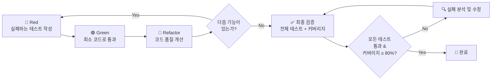

# TDD (Test-Driven Development) 워크플로우

## 개요

이 워크플로우는 **Red → Green → Refactor** 사이클을 엄격히 따르며, Unit / Integration / E2E 테스트를 모두 작성하고, **코드 커버리지 80% 이상**을 유지하는 TDD 프로세스를 정의합니다.

---

## 0. 사전 준비

1. 테스트 프레임워크가 설치되어 있는지 확인합니다.
   - **Unit / Integration**: `vitest` + `@testing-library/react` (React 컴포넌트인 경우)
   - **E2E**: `playwright`
   - 커버리지: `@vitest/coverage-v8`

2. 설정 파일이 존재하는지 확인합니다.
   - `vitest.config.ts` — 커버리지 임계값 설정 포함
   - `playwright.config.ts` — E2E 설정

3. `package.json`에 다음 스크립트가 있는지 확인합니다.
   ```json
   {
     "scripts": {
       "test": "vitest run",
       "test:watch": "vitest",
       "test:coverage": "vitest run --coverage",
       "test:e2e": "playwright test"
     }
   }
   ```

> [!IMPORTANT]
> 위 도구가 설치되어 있지 않으면 먼저 설치하세요:
> ```bash
> npm install -D vitest @vitest/coverage-v8 @testing-library/react @testing-library/jest-dom jsdom playwright @playwright/test
> ```

---

## 1. 🔴 Red Phase — 실패하는 테스트 작성

**목표**: 구현하려는 기능의 **기대 동작을 테스트로 먼저 정의**합니다. 이 단계에서 테스트는 반드시 **실패해야** 합니다.

### 1-1. 요구사항 분석

- 구현할 기능의 입력/출력/부수효과를 명확히 정의합니다.
- 경계값(edge case), 에러 케이스, 정상 케이스를 분류합니다.

### 1-2. 테스트 파일 생성 규칙

| 테스트 종류 | 파일 위치 | 네이밍 패턴 |
|---|---|---|
| Unit Test | `__tests__/unit/` 또는 소스 파일 옆 | `*.test.ts`, `*.test.tsx` |
| Integration Test | `__tests__/integration/` | `*.integration.test.ts` |
| E2E Test | `e2e/` 또는 `__tests__/e2e/` | `*.e2e.test.ts`, `*.spec.ts` |

### 1-3. 테스트 작성 원칙

```typescript
// ✅ 좋은 예: 명확한 테스트 구조 (AAA 패턴)
describe('기능명', () => {
  describe('정상 케이스', () => {
    it('주어진 조건에서 기대하는 결과를 반환해야 한다', () => {
      // Arrange - 테스트 데이터 준비
      const input = { /* ... */ };

      // Act - 테스트 대상 실행
      const result = targetFunction(input);

      // Assert - 기대 결과 검증
      expect(result).toEqual(expectedOutput);
    });
  });

  describe('에러 케이스', () => {
    it('잘못된 입력에 대해 에러를 던져야 한다', () => {
      expect(() => targetFunction(null)).toThrow('에러 메시지');
    });
  });

  describe('경계값 케이스', () => {
    it('빈 배열에 대해 빈 결과를 반환해야 한다', () => {
      expect(targetFunction([])).toEqual([]);
    });
  });
});
```

### 1-4. 테스트 실행 및 실패 확인

```bash
# Unit / Integration 테스트 실행
npm run test

# E2E 테스트 실행
npm run test:e2e
```

> [!CAUTION]
> Red Phase에서 테스트가 **통과하면 안 됩니다**. 테스트가 통과한다면 테스트가 의미 없거나, 이미 구현이 존재하는 것입니다. 테스트가 올바르게 실패하는지 반드시 확인하세요.

---

## 2. 🟢 Green Phase — 테스트를 통과하는 최소 코드 작성

**목표**: 작성한 테스트를 **가장 간단한 방법으로 통과**시킵니다. 완벽한 코드가 아니어도 괜찮습니다.

### 2-1. 구현 원칙

- **최소한의 코드만 작성합니다.** 테스트를 통과시키는 데 필요한 것 이상을 구현하지 않습니다.
- 하드코딩이라도 괜찮습니다. 리팩토링은 다음 단계에서 진행합니다.
- 한 번에 하나의 테스트만 통과시킵니다.

### 2-2. 테스트 실행 및 통과 확인

```bash
npm run test
```

> [!IMPORTANT]
> 모든 테스트가 **통과(PASS)** 되어야 합니다. 하나라도 실패하면 코드를 수정하여 통과시키세요.

---

## 3. 🔵 Refactor Phase — 코드 개선

**목표**: 테스트가 통과하는 상태를 **유지하면서** 코드 품질을 개선합니다.

### 3-1. 리팩토링 체크리스트

- [ ] **중복 제거**: 반복되는 코드를 함수/유틸리티로 추출
- [ ] **네이밍 개선**: 변수, 함수, 클래스명이 의도를 명확히 표현하는지 확인
- [ ] **단일 책임 원칙**: 함수/클래스가 하나의 역할만 수행하는지 확인
- [ ] **타입 안전성**: TypeScript의 타입을 적극 활용
- [ ] **불필요한 코드 제거**: 사용하지 않는 변수, import 정리
- [ ] **테스트 코드 리팩토링**: 테스트 자체의 중복도 제거 (공유 fixture, helper 등)

### 3-2. 리팩토링 후 테스트 재실행

```bash
# 모든 테스트가 여전히 통과하는지 확인
npm run test
```

> [!WARNING]
> 리팩토링 후 테스트가 실패하면, 리팩토링이 기능을 변경한 것입니다. 즉시 원인을 파악하고 수정하세요.

---

## 4. 테스트 종류별 작성 가이드

### 4-1. Unit Test (단위 테스트)

**대상**: 개별 함수, 클래스, 유틸리티, 훅, 컴포넌트 등

```typescript
// 예시: 유틸 함수 단위 테스트
import { describe, it, expect } from 'vitest';
import { formatPrice } from '@/shared/utils/format';

describe('formatPrice', () => {
  it('숫자를 원화 형식으로 변환해야 한다', () => {
    expect(formatPrice(10000)).toBe('₩10,000');
  });

  it('0을 처리해야 한다', () => {
    expect(formatPrice(0)).toBe('₩0');
  });

  it('음수를 처리해야 한다', () => {
    expect(formatPrice(-5000)).toBe('-₩5,000');
  });
});
```

**React 컴포넌트 테스트:**

```typescript
import { describe, it, expect } from 'vitest';
import { render, screen } from '@testing-library/react';
import { Button } from '@/shared/ui/Button';

describe('Button', () => {
  it('children 텍스트를 렌더링해야 한다', () => {
    render(<Button>클릭</Button>);
    expect(screen.getByText('클릭')).toBeInTheDocument();
  });

  it('disabled 상태일 때 클릭이 불가능해야 한다', () => {
    const onClick = vi.fn();
    render(<Button disabled onClick={onClick}>클릭</Button>);
    screen.getByText('클릭').click();
    expect(onClick).not.toHaveBeenCalled();
  });
});
```

### 4-2. Integration Test (통합 테스트)

**대상**: 여러 모듈이 함께 동작하는 흐름, API 라우트 핸들러, 데이터베이스 연동 등

```typescript
// 예시: API Route + 서비스 계층 통합 테스트
import { describe, it, expect, beforeEach } from 'vitest';

describe('POST /api/posts', () => {
  beforeEach(async () => {
    // 테스트 데이터베이스 초기화 또는 mock 설정
  });

  it('유효한 데이터로 게시글을 생성해야 한다', async () => {
    const response = await fetch('/api/posts', {
      method: 'POST',
      headers: { 'Content-Type': 'application/json' },
      body: JSON.stringify({
        title: '테스트 게시글',
        content: '테스트 내용',
      }),
    });

    expect(response.status).toBe(201);
    const data = await response.json();
    expect(data.title).toBe('테스트 게시글');
  });

  it('제목이 없으면 400 에러를 반환해야 한다', async () => {
    const response = await fetch('/api/posts', {
      method: 'POST',
      headers: { 'Content-Type': 'application/json' },
      body: JSON.stringify({ content: '내용만' }),
    });

    expect(response.status).toBe(400);
  });
});
```

### 4-3. E2E Test (End-to-End 테스트)

**대상**: 사용자 관점의 전체 흐름, 브라우저 기반 시나리오

```typescript
// 예시: Playwright E2E 테스트
import { test, expect } from '@playwright/test';

test.describe('로그인 흐름', () => {
  test('유효한 자격증명으로 로그인할 수 있어야 한다', async ({ page }) => {
    await page.goto('/login');

    await page.fill('[data-testid="email-input"]', 'user@example.com');
    await page.fill('[data-testid="password-input"]', 'password123');
    await page.click('[data-testid="login-button"]');

    await expect(page).toHaveURL('/dashboard');
    await expect(page.locator('[data-testid="welcome-message"]')).toContainText('환영합니다');
  });

  test('잘못된 비밀번호로 로그인 시 에러 메시지가 표시되어야 한다', async ({ page }) => {
    await page.goto('/login');

    await page.fill('[data-testid="email-input"]', 'user@example.com');
    await page.fill('[data-testid="password-input"]', 'wrong-password');
    await page.click('[data-testid="login-button"]');

    await expect(page.locator('[data-testid="error-message"]')).toBeVisible();
  });
});
```

---

## 5. 최종 검증

모든 구현이 완료된 후, 반드시 아래 단계를 수행합니다.

### 5-1. 전체 테스트 실행

```bash
# 모든 Unit + Integration 테스트 실행
npm run test

# E2E 테스트 실행
npm run test:e2e
```

### 5-2. 커버리지 확인

```bash
npm run test:coverage
```

> [!IMPORTANT]
> 커버리지가 **80% 미만**이면 다음 단계를 수행하세요:
> 1. 커버리지 리포트에서 커버되지 않은 라인/분기를 확인합니다.
> 2. 해당 코드 경로에 대한 추가 테스트를 작성합니다.
> 3. Red → Green → Refactor 사이클을 다시 수행합니다.
> 4. 커버리지가 80% 이상이 될 때까지 반복합니다.

### 5-3. 실패 테스트 분석 및 수정

테스트가 실패한 경우, 다음 프로세스를 따릅니다:

```
1. 실패 로그 확인
   └── 어떤 테스트가 실패했는지 식별
   └── 에러 메시지와 스택 트레이스 분석

2. 원인 분류
   ├── 🐛 구현 버그: 비즈니스 로직 오류 → 코드 수정
   ├── 📝 테스트 오류: 잘못된 기대값/mock 설정 → 테스트 수정
   ├── 🔗 의존성 문제: 외부 서비스/모듈 변경 → mock 업데이트
   └── ⏱️ 타이밍 이슈: 비동기 처리 누락 → await/waitFor 추가

3. 수정 적용
   └── 수정 후 해당 테스트만 먼저 실행하여 통과 확인
   └── 전체 테스트 스위트 재실행하여 회귀 없는지 확인
```

> [!CAUTION]
> 테스트를 삭제하여 "통과"시키지 마세요. 실패하는 테스트는 반드시 원인을 파악하고 코드 또는 테스트를 수정해야 합니다.

---

## 6. TDD 사이클 요약



---

## 7. 체크리스트

기능 구현 완료 시 최종 확인 사항:

- [ ] 모든 Unit Test 통과
- [ ] 모든 Integration Test 통과
- [ ] 모든 E2E Test 통과
- [ ] 코드 커버리지 ≥ 80%
- [ ] 실패 테스트 0건
- [ ] 테스트 코드에 명확한 설명 (describe, it 네이밍)
- [ ] 경계값 및 에러 케이스 포함
- [ ] mock/stub 최소화 (가능하면 실제 구현 사용)
- [ ] 리팩토링 후 회귀 테스트 통과
